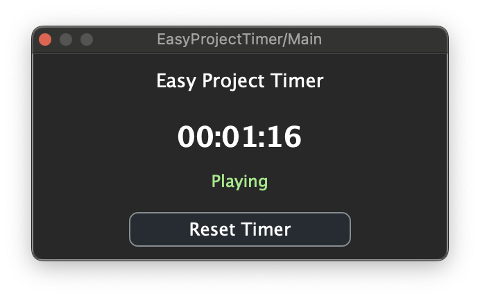

# Easy Project Timer

A simple VST/AU plugin for tracking time spent on your music projects. Only counts time while your DAW is actively playing, giving you accurate work session tracking.

## Features

- ⏱️ **Smart Time Tracking** - Only counts time during playback
- 💾 **Project Persistence** - Timer state saves with your project
- 🎯 **Real-time Updates** - Live display updates every 100ms
- 🔄 **Reset Function** - Start fresh anytime
- 🎵 **DAW Integration** - Works with Ableton Live, Logic Pro, Pro Tools, and more

## Usage

1. Load the plugin on any track in your DAW
2. The timer automatically starts when you hit play
3. Pauses when you stop playback
4. Your total project time is saved with the project file
5. Use "Reset Timer" to start tracking a new session

## Building

Built with JUCE framework. Open the `.jucer` file in Projucer and generate your platform-specific project files.

Requirements:
- JUCE 7.0+
- C++17 compatible compiler

## Installation

Copy the built plugin files to your system's plugin directory:
- **macOS**: `~/Library/Audio/Plug-Ins/VST3/` or `~/Library/Audio/Plug-Ins/Components/`
- **Windows**: `C:\Program Files\Common Files\VST3\`

## License

MIT License - feel free to use and modify for your projects.
